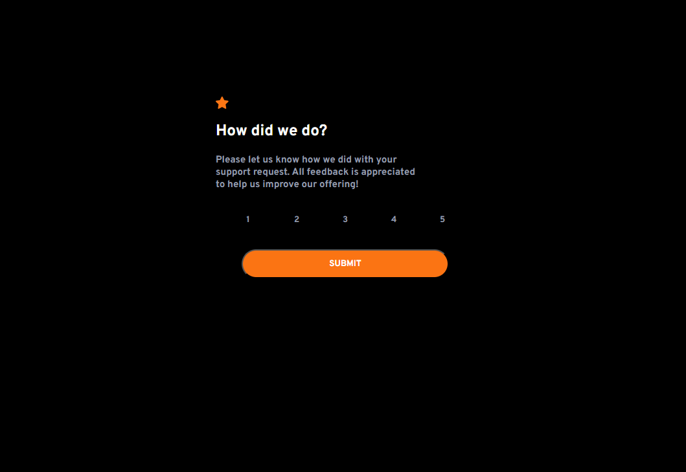
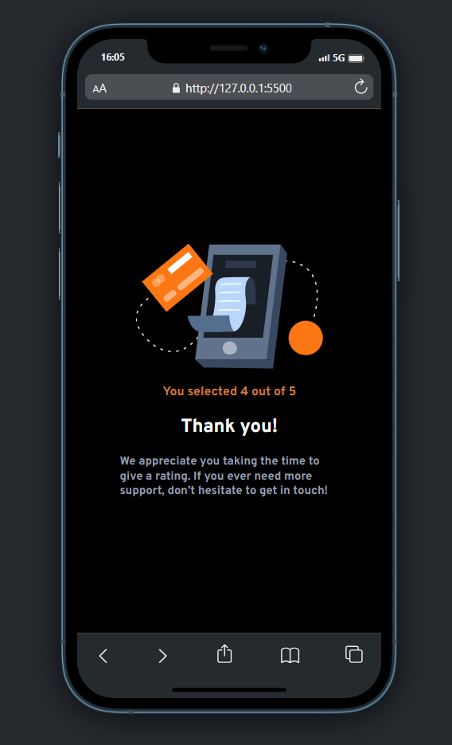

# Frontend Mentor - solução do componente de classificação interativa

Esta é uma solução para o [desafio do componente de classificação interativa no Frontend Mentor](https://www.frontendmentor.io/challenges/interactive-rating-component-koxpeBU)

## Capturas de tela

**Visualização da solução desktop**

**Visualização da solução mobile**

## Links
- Código da solução: [visualizar](https://github.com/HenriqueTavares12/desafios-frontend-mentor/tree/main/newbie/interactive-rating-component-main)
- Clique para visualizar: [visualizar](https://henriquetavares12.github.io/desafios-frontend-mentor/newbie/interactive-rating-component-main/)
 
## Construído com 
- Marcação HTML5 semântica
- Propriedades personalizadas CSS
- Flexbox
- Mobile First
- Manipulação do DOM JavaScript
