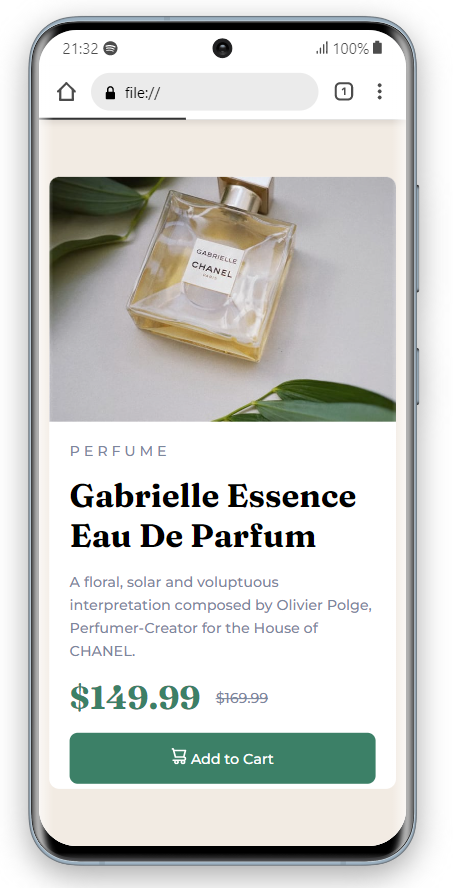

# Frontend Mentor - solução de componente de cartão de visualização do produto

Esta é uma solução para o [desafio do componente do cartão de visualização do produto no Frontend Mentor](https://www.frontendmentor.io/challenges/product-preview-card-component-GO7UmttRfa). Os desafios do Frontend Mentor ajudam você a melhorar suas habilidades de codificação criando projetos realistas.

## Capturas de tela

**Visualização da solução desktop**

**Visualização da solução mobile**

## Links

 
## Construído com 
- Marcação HTML5 semântica
- Propriedades personalizadas CSS
- Flexbox
- Mobile First