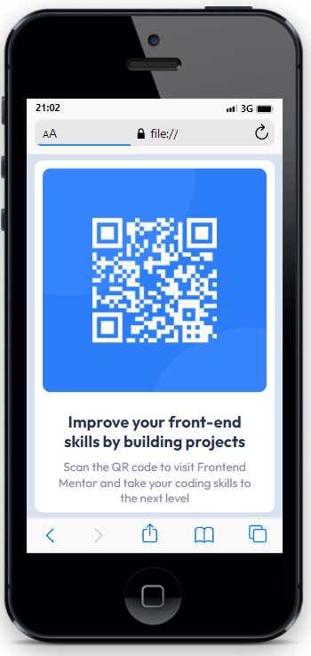

# Frontend Mentor - solução de componente de código QR

Esta é uma solução para o [desafio do componente de código QR no Frontend Mentor](https://www.frontendmentor.io/challenges/qr-code-component-iux_sIO_H). Os desafios do Frontend Mentor ajudam você a melhorar suas habilidades de codificação criando projetos realistas.

## Captura de tela
**Visualização da solução desktop** 

**Visualização da solução mobile**

## Links

- Código da solução: 
- Clique para visualizar: 

## Meu processo
    Análise das cores e fontes definidas no design do desafio para construção da minha solução.

## Construído com
- Marcação HTML5 semântica
- Propriedades personalizadas CSS
- Flexbox

