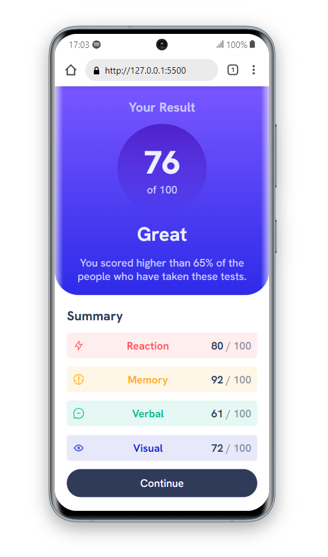
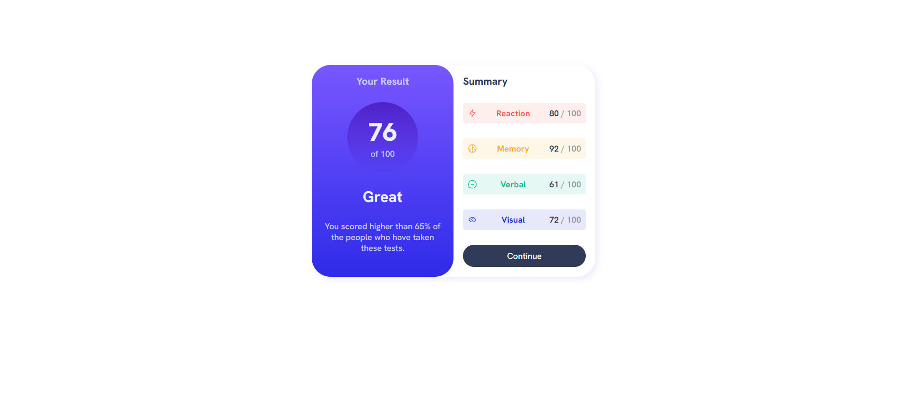

# Frontend Mentor - Solução de componente de resumo de resultados

Esta é uma solução para o [desafio do componente de resumo de resultados no Frontend Mentor](https://www.frontendmentor.io/challenges/results-summary-component-CE_K6s0maV). Os desafios do Frontend Mentor ajudam você a melhorar suas habilidades de codificação criando projetos realistas.

## Índice

   - [Visão geral](#visão-geral)
   - [O desafio](#o-desafio)
   - [Captura de tela](#captura-de-tela)
   - [Links](#links)
   - [Meu processo](#meu-processo)
   - [O que aprendi](#o-que-aprendi)

## Visão geral

### O desafio

Os usuários devem ser capazes de:

- Ver o layout ideal para a interface, dependendo do tamanho da tela do dispositivo
- Ver os estados de foco para os elementos interativos na página

### Captura de tela

### Links

- URL da solução: [Adicionar URL da solução aqui](https://your-solution-url.com)
- Clique aqui para visualizar: [Adicione URL do site ao vivo aqui](https://your-live-site-url.com)

## Meu processo
  Analisei todo o layout observando como montar os elementos na tela para chegar a uma solução bem
  semelhante ao do desafio proposto.
### Construído com

- Marcação HTML5 semântica
- Propriedades personalizadas CSS
- Flexbox

### O que eu aprendi
- Consumir arquivo JSON com dinâmicamente com o JavaScript 

